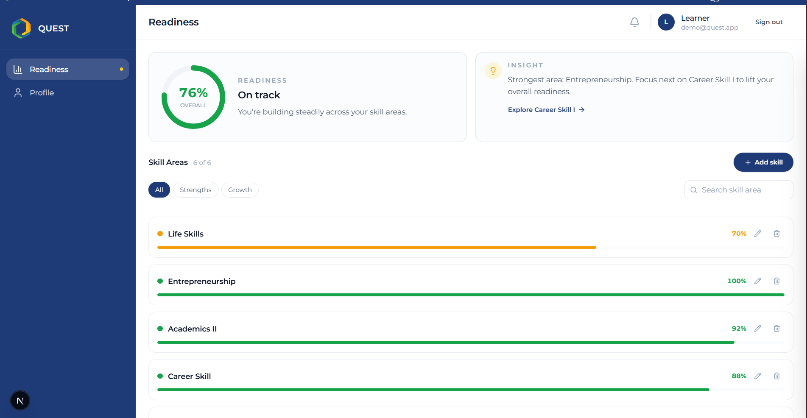

# Quest Learner Readiness — Frontend Application

## Overview

This project implements a learner-facing readiness dashboard for Quest, Nova Pioneer’s post-school success platform.

The application presents a clear, human-readable view of readiness for life after secondary school by:

- Displaying an overall readiness state
- Breaking readiness down across skill areas
- Surfacing focused insights and next steps

The emphasis is clarity of thinking, system design, and UI/UX intent over backend complexity.

---

## Links

- Live App: https://quest-learner-readiness.vercel.app/
- GitHub Repository: https://github.com/hermitex/quest-learner-readiness

---

## UI Preview



---

## Product Context

Learners using Quest need a simple, motivating way to understand:

- Where they currently stand
- What they are doing well
- What to focus on next

Primary user: a 15–18 year old learner in Kenya using a mobile-first experience.

---

## How To Run

```bash
npm install
npm run dev
```

Open `http://localhost:3000`.

---

## PWA and Offline Support

This app is installable and resilient in low-connectivity environments:

- Web manifest + app icons for install
- Service worker caches core assets and the offline screen
- IndexedDB persistence for skills and offline edits
- Sync queue flushes changes when the device reconnects
- Offline and syncing banners provide user feedback

---

## UI Structure

The UI is intentionally limited to 2–4 key screens to reduce cognitive load:

- Learner dashboard
- Skill breakdown list with focused drawer
- Drawer forms for create/edit/delete skill areas

Core components:

- `src/components/dashboard/readiness-dashboard.tsx`
- `src/components/dashboard/overall-summary.tsx`
- `src/components/dashboard/skill-breakdown.tsx`
- `src/components/layout/side-drawer/skill-drawer.tsx`

---

## Mock Data

The UI is powered by local JSON:

File: `src/services/mocks/readiness.json`

```json
{
  "overallScore": 65,
  "skills": [
    { "id": "academics", "label": "Academics", "score": 80 },
    { "id": "career", "label": "Career Skills", "score": 60 },
    { "id": "life", "label": "Life Skills", "score": 70 },
    { "id": "entrepreneurship", "label": "Entrepreneurship", "score": 50 }
  ]
}
```

Interpretation and insights are derived client-side:

- Scores are translated into human-readable states
- Strongest and focus areas are identified deterministically
- Learner-facing insights update as the data changes

---

## Interaction & UX

Meaningful interactions included:

- Drawer-based skill detail and edit flows
- Search and filter for fast scanning
- Validation for skill names and score ranges
- Offline and sync feedback

Language is neutral and encouraging, aligning with Nova Pioneer’s culture principles.

---

## Technology Stack

- React
- Next.js
- TypeScript
- Tailwind CSS
- Zustand
- IndexedDB (local persistence)
- Service Worker + Web Manifest (PWA)
- Lucide Icons

No external services or databases are required.

---

## Assumptions & Tradeoffs

- Data is mocked locally to mirror a future readiness API.
- Skill edits are stored locally and synced when online.
- The side drawer is the primary interaction pattern to keep learners oriented.

Extension ideas:

- Replace the mock with a real API client and caching
- Add offline-first conflict resolution
- Add learner profile and goal-setting views

---

## Documentation

Design and system rationale are captured in `/docs`:

- [System Design](docs/system-design.md)
- [API Design](docs/api-design.md)
- [UI/UX Design](docs/ui-ux-design.md)
- [Feature Inventory](docs/features.md)
- [Folder Structure](docs/folder-structure.md)

---

## Design Decisions

Philosophy: **Don’t make me think.**

The UI prioritizes immediate comprehension and low cognitive load:

- Clear hierarchy with a single primary summary and a focused insight.
- Scan-friendly skill list with consistent visual rhythm and strong affordances.
- Progressive disclosure via drawers to keep context while revealing detail.
- Subtle, meaningful feedback (sync states, deltas, validation) without noise.

---

## Loom Walkthrough

Add your Loom walkthrough link here:

- Loom: [Link](https://www.loom.com/share/0e29e5b2a4b448cfa68b575662212140)
