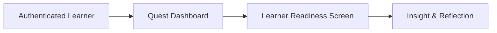

# Feature Documentation — Quest Learner Readiness

## 1. Purpose

This document describes the functional features of the Quest Learner Readiness experience, including:

- Feature responsibilities
- User journey flow
- System interactions
- Capabilities and limitations

The intent is to make feature scope and behavior explicit and reviewable.

---

## 2. End-to-End Learner Journey (Context)

Although authentication and navigation are out of scope for this task, the readiness experience exists within a broader learner journey.

Only the **Learner Readiness Screen** and its internal features are implemented in this submission.

---

## 3. Feature Inventory

### Implemented Features

1. Learner Readiness Overview
2. Skill Area Breakdown
3. Insight & Recommendation Generation
4. Skill Management Drawer (view, create, edit, delete)
5. Search and Filter for Skills
6. Validation and Feedback (toasts, errors)
7. Offline Persistence + Sync Queue
8. PWA Installability + Offline Fallback

---

## 4. Feature — Learner Readiness Overview

### Description

Displays a high-level summary of the learner’s readiness state.

### Capabilities

- Shows overall readiness score
- Translates score into human-readable meaning
- Displays a short explanatory message

### Limitations

- Single snapshot only
- No historical comparison

---

## 5. Feature — Skill Area Breakdown

### Description

Breaks readiness down across defined skill dimensions.

### Capabilities

- Displays per-skill readiness scores
- Allows visual comparison
- Identifies strengths and growth areas
- Search and filter by skill name or status

### Limitations

- Skill taxonomy is fixed
- No user-defined categories

---

## 6. Feature — Insight & Recommendation Generation

### Description

Generates learner-facing insights from readiness data.

### Capabilities

- Identifies strongest skill area
- Identifies focus (lowest) skill area
- Produces one clear recommendation or encouragement

### Limitations

- Rule-based only
- No AI or personalization beyond scores

---

## 7. Feature — Skill Management Drawer

### Description

A slide-over drawer enables learners to view, create, edit, and delete skill areas without losing context.

### Capabilities

- View skill detail context
- Create new skill area
- Edit skill name and score
- Delete skill area with confirmation
- Inline validation with user-friendly errors

### Limitations

- Local-only data changes
- No multi-user conflict handling

---

## 8. Feature — Offline Persistence + Sync

### Description

Changes are retained offline and synced when network returns.

### Capabilities

- IndexedDB persistence for skills
- Offline queue for create/edit/delete
- Auto-sync on reconnect
- Sync and offline status badges

### Limitations

- No real server sync yet
- Conflict resolution not implemented

---

## 9. Feature — PWA Installability

### Description

The app is installable and provides offline resilience.

### Capabilities

- Web manifest with icons
- Service worker for offline fallback
- Cached assets for faster cold starts

---

## 10. Known Limitations (System-Level)

- No authentication
- No backend persistence
- No historical trends or analytics
- No multi-learner data model

---

## 11. Future Feature Extensions (Non-Blocking)

- Live API integration with server sync
- Conflict resolution for offline edits
- Historical readiness tracking
- Educator and parent views
- Adaptive recommendations

---
