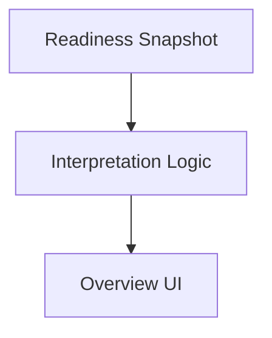
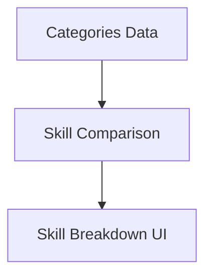
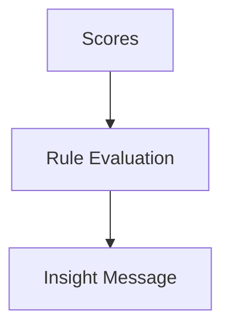
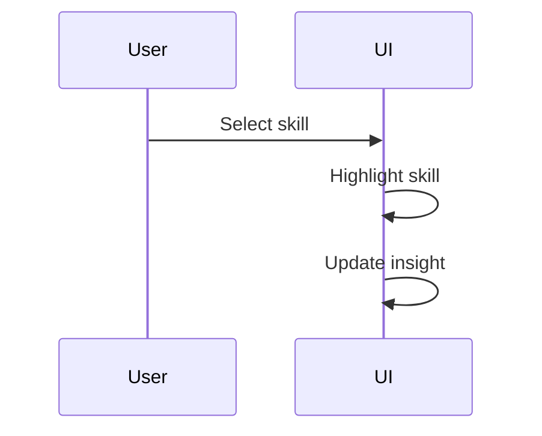
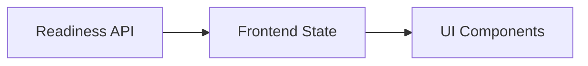
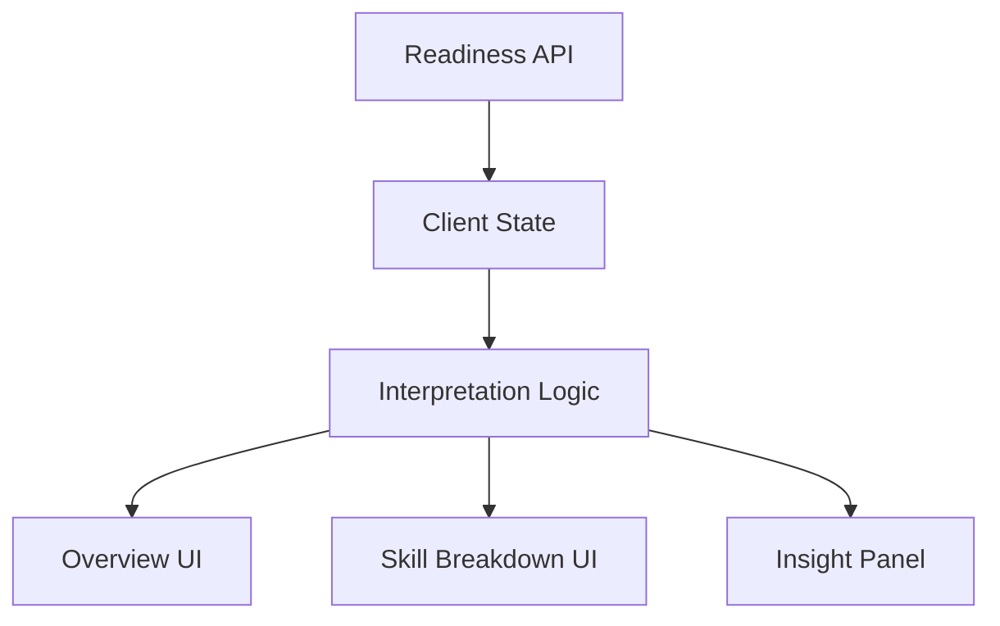

# Feature Documentation — Quest Learner Readiness

## 1. Purpose

This document describes the functional features of the Quest Learner Readiness experience, including:

- Feature responsibilities
- User journey flow
- System interactions
- Capabilities and limitations

The intent is to make feature scope and behavior explicit and reviewable.

---

## 2. End-to-End Learner Journey (Context)

Although authentication and navigation are out of scope for this task, the readiness experience exists within a broader learner journey.

```mermaid
flowchart LR
  A[Authenticated Learner] --> B[Quest Dashboard]
  B --> C[Learner Readiness Screen]
  C --> D[Insight & Reflection]
````

**Note:**
Only the **Learner Readiness Screen** and its internal features are implemented in this submission.

---

## 3. Feature Inventory

### Implemented Features

1. Learner Authentication (contextual, out-of-scope)
2. Learner Readiness Overview
3. Skill Area Breakdown
4. Insight & Recommendation Generation
5. Interactive Skill Focus
6. Standardized API Consumption
7. Client-Side Interpretation Logic

---

## 4. Feature 1 — Learner Authentication (Context Only)

### Description

Represents the learner’s authenticated entry into the Quest platform.

### Capabilities

- Ensures readiness data is learner-specific
- Provides identity context for API requests

### Limitations

- Authentication is **not implemented**
- Assumed to be handled upstream by the Quest platform

### Interaction

```mermaid
sequenceDiagram
  participant Learner
  participant Quest as Quest Platform
  Learner->>Quest: Login
  Quest-->>Learner: Authenticated Session
```

---

## 5. Feature 2 — Learner Readiness Overview

### Description

Displays a high-level summary of the learner’s readiness state.

### Capabilities

- Shows overall readiness score
- Translates score into human-readable meaning
- Displays a short explanatory message

### Limitations

- Single snapshot only
- No historical comparison

### Internal Flow



---

## 6. Feature 3 — Skill Area Breakdown

### Description

Breaks readiness down across defined skill dimensions.

### Capabilities

- Displays per-skill readiness scores
- Allows visual comparison
- Identifies strengths and growth areas

### Limitations

- Skill taxonomy is fixed
- No user customization of skill areas

### Internal Flow



---

## 7. Feature 4 — Insight & Recommendation Generation

### Description

Generates learner-facing insights from readiness data.

### Capabilities

- Identifies strongest skill area
- Identifies focus (lowest) skill area
- Produces one clear recommendation or encouragement

### Limitations

- Rule-based only
- No AI or personalization beyond scores

### Logic Flow



---

## 8. Feature 5 — Interactive Skill Focus

### Description

Provides a lightweight interaction to explore skill areas.

### Capabilities

- Tap/click to focus a skill
- Updates insight message dynamically
- No navigation or modal context switch

### Limitations

- One skill focused at a time
- No deep drill-down

### Interaction Flow



---

## 9. Feature 6 — Standardized API Consumption

### Description

Consumes readiness data via a stable, versioned API contract.

### Capabilities

- Uses standard response envelope
- Backend-agnostic
- Easily replaceable mock data source

### Limitations

- Read-only
- No mutation or submission endpoints

### Data Flow



---

## 10. Feature 7 — Client-Side Interpretation Logic

### Description

Separates raw data from learner-facing meaning.

### Capabilities

- Converts scores into states (e.g. “On track”)
- Keeps backend logic minimal
- Enables multiple future clients

### Limitations

- Interpretation rules are static
- Requires redeploy for rule changes

---

## 11. Feature Interaction Map



---

## 12. Known Limitations (System-Level)

- No persistence
- No authentication
- No history or trends
- No AI-driven recommendations
- No offline support

These are **intentionally excluded** to maintain focus and clarity.

---

## 13. Design Rationale

Features are intentionally small, composable, and learner-focused.

The system prioritizes:

- Understanding over analytics
- Guidance over data density
- Simplicity over feature breadth

This approach aligns with the learner context and task scope.

---

## 14. Future Feature Extensions (Non-Blocking)

- Historical readiness tracking
- Educator and parent views
- Program-specific readiness
- Adaptive recommendations
- Content linking from insights
