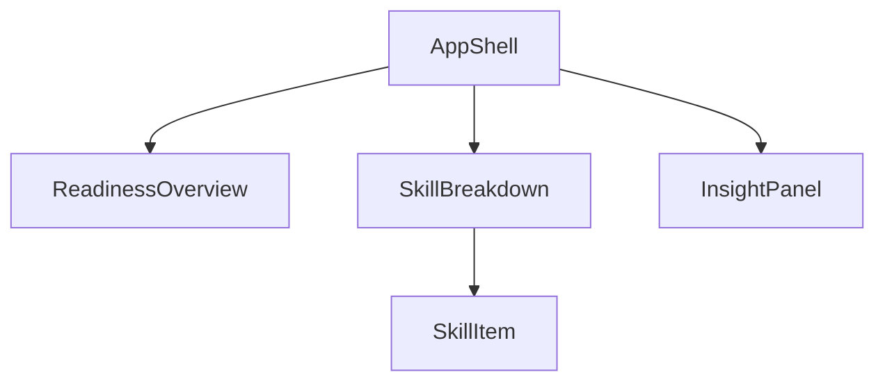
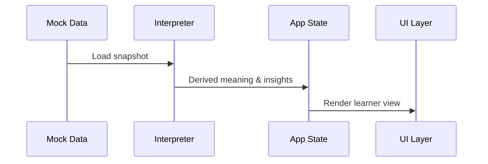

# System Design — Quest Learner Readiness

## 1. Purpose

The Quest Learner Readiness system provides learners with a clear, understandable view of their preparedness for life after secondary school. The primary goal is to translate readiness data into meaningful insights that help learners recognize strengths, identify growth areas, and understand what to focus on next.

This system is designed as a frontend-only implementation consuming mocked data, while maintaining contracts and structure suitable for future backend integration.

---

## 2. Scope

### In Scope

- Representation of learner readiness state
- Interpretation of readiness scores into human-readable meaning
- Visualization of readiness across multiple skill areas
- Generation of simple insights and recommendations
- Mobile-first learner-facing experience

### Out of Scope

- Authentication and user management
- Data persistence
- Backend services
- AI or adaptive recommendation models

---

## 3. High-Level Architecture

The system separates raw data, interpretation logic, and presentation to ensure clarity, testability, and future extensibility.

```mermaid
graph TD
  A[Mock Readiness Data] --> B[Interpretation Layer]
  B --> C[Application State]
  C --> D[UI Components]
````

**Key principle:**
Raw scores are never rendered directly. All values pass through an interpretation layer before reaching the UI.

---

## 4. Data Model

### 4.1 Core Types

```ts
ReadinessSnapshot {
  learnerId: string
  generatedAt: string
  overallScore: number
  categories: ReadinessCategory[]
}
```

```ts
ReadinessCategory {
  id: string
  label: string
  score: number
  description: string
}
```

---

### 4.2 Mock Data Contract

```json
{
  "learnerId": "learner-001",
  "generatedAt": "2026-01-15T10:00:00Z",
  "overallScore": 65,
  "categories": [
    {
      "id": "academics",
      "label": "Academics",
      "score": 80,
      "description": "Academic readiness for further study"
    },
    {
      "id": "career_skills",
      "label": "Career Skills",
      "score": 60,
      "description": "Preparation for the workplace"
    },
    {
      "id": "life_skills",
      "label": "Life Skills",
      "score": 70,
      "description": "Independence and self-management"
    },
    {
      "id": "entrepreneurship",
      "label": "Entrepreneurship",
      "score": 50,
      "description": "Innovation and initiative"
    }
  ]
}
```

This structure mirrors a future readiness service API response.

---

## 5. Interpretation Logic

### 5.1 Overall Score Meaning

| Score Range | Meaning              |
| ----------- | -------------------- |
| 0–39        | Just starting        |
| 40–59       | Building foundations |
| 60–79       | On track             |
| 80–100      | Highly ready         |

---

### 5.2 Insight Rules

- **Strongest area:** category with highest score
- **Focus area:** category with lowest score
- **Balanced profile:** difference between highest and lowest scores ≤ 15

Insights are generated deterministically on the client.

Example:

> “You are strongest in Academics. Focusing next on Entrepreneurship will improve your overall readiness.”

---

## 6. Frontend Component Structure



**Responsibilities**

- `ReadinessOverview`: summary and overall status
- `SkillBreakdown`: comparison across skill areas
- `InsightPanel`: interpretation and recommendation messaging

---

## 7. Data Flow



---

## 8. UI and UX Principles

- Mobile-first layout
- Meaning before numbers
- Consistent visual scale across skill areas
- Strengths emphasized without overstating
- Growth areas highlighted constructively

Interaction is kept minimal and intentional to avoid cognitive overload.

---

## 9. Accessibility Considerations

- Color is never the sole carrier of meaning
- Text labels accompany all indicators
- Adequate contrast for readability
- Touch-friendly interaction targets

---

## 10. Future Extensions

- Replace mock data with live API integration
- Support historical readiness tracking
- Add educator or parent views
- Introduce adaptive or AI-assisted recommendations

---

## 11. Design Rationale

The system prioritizes learner understanding over analytical depth. Architectural separation ensures that future changes to scoring logic, data sources, or presentation can be made independently without restructuring the entire application.
