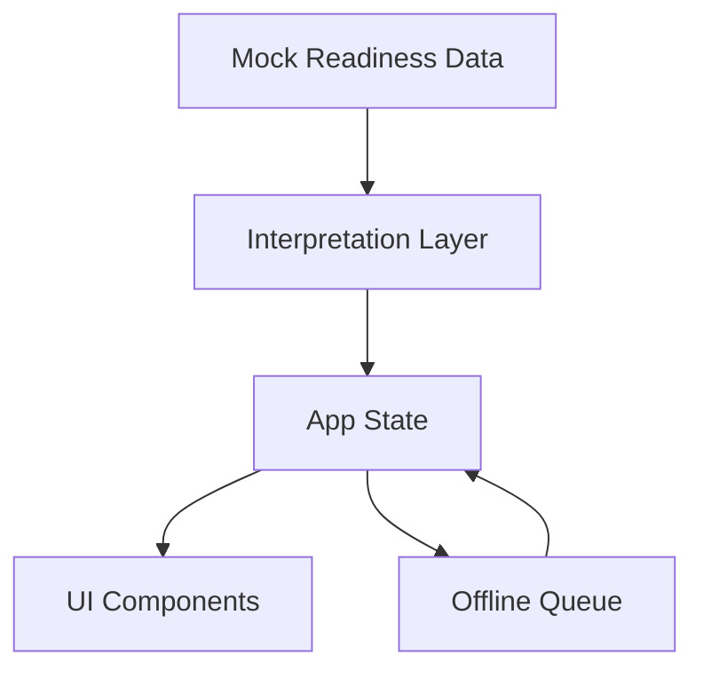
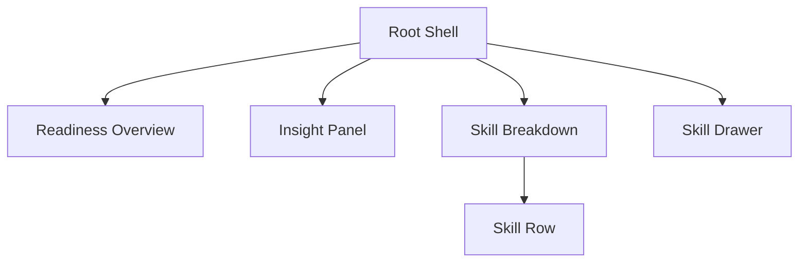

# System Design — Quest Learner Readiness

## 1. Purpose

The Quest Learner Readiness system provides learners with a clear, understandable view of their preparedness for life after secondary school. The primary goal is to translate readiness data into meaningful insights that help learners recognize strengths, identify growth areas, and understand what to focus on next.

This system is designed as a frontend-only implementation consuming mocked data, while maintaining contracts and structure suitable for future backend integration.

---

## 2. Scope

### In Scope

- Representation of learner readiness state
- Interpretation of readiness scores into human-readable meaning
- Visualization of readiness across multiple skill areas
- Generation of simple insights and recommendations
- Mobile-first learner-facing experience
- Offline-first behavior (local persistence + sync queue)
- PWA installability and offline fallback

### Out of Scope

- Authentication and user management
- Backend services
- AI or adaptive recommendation models
- Multi-learner history and analytics

---

## 3. High-Level Architecture

The system separates raw data, interpretation logic, state, and presentation to ensure clarity, testability, and future extensibility.



**Key principle:**
Raw scores are never rendered directly. All values pass through an interpretation layer before reaching the UI.

---

## 4. Data Model

### 4.1 Core Types (Current)

```ts
ReadinessData {
  overallScore: number
  skills: Skill[]
}

Skill {
  id: string
  label: string
  score: number
}
```

### 4.2 Mock Data Contract

```json
{
  "overallScore": 65,
  "skills": [
    { "id": "academics", "label": "Academics", "score": 80 },
    { "id": "career", "label": "Career Skills", "score": 60 },
    { "id": "life", "label": "Life Skills", "score": 70 },
    { "id": "entrepreneurship", "label": "Entrepreneurship", "score": 50 }
  ]
}
```

This structure mirrors a future readiness service response, simplified for this exercise.

---

## 5. Interpretation Logic

### 5.1 Overall Score Meaning

| Score Range | Meaning              |
| ----------- | -------------------- |
| 0–39        | Getting started      |
| 40–59       | Making progress      |
| 60–79       | On track             |
| 80–100      | Highly ready         |

### 5.2 Insight Rules

- **Strongest area:** skill with highest score
- **Focus area:** skill with lowest score
- **Balanced profile:** difference between highest and lowest scores ≤ 10

Example:

> “Strongest area: Academics. Focus next on Entrepreneurship to lift your overall readiness.”

---

## 6. Frontend Component Structure



Responsibilities:

- `ReadinessOverview`: summary and overall status
- `InsightPanel`: interpretation and recommendation messaging
- `SkillBreakdown`: list, search, and filters
- `SkillDrawer`: view, create, edit, delete flows

---

## 7. Offline Architecture

Offline-first behavior is implemented entirely client-side:

- **IndexedDB** persists skills and offline queue
- **Sync queue** stores create/edit/delete actions when offline
- **Auto-sync** flushes queue on reconnect
- **Service worker** provides offline fallback and caches core assets

---

## 8. Accessibility Considerations

- Color is never the sole carrier of meaning
- Text labels accompany indicators
- Adequate contrast for readability
- Touch-friendly interaction targets
- ARIA for error states and dialogs

---

## 9. Future Extensions

- Replace mock data with live API integration
- Add historical readiness tracking
- Add educator or parent views
- Introduce adaptive recommendations
- Support conflict resolution on sync

---
